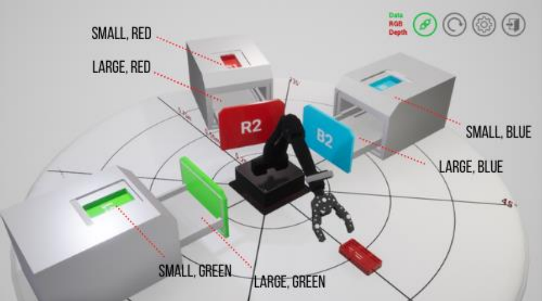
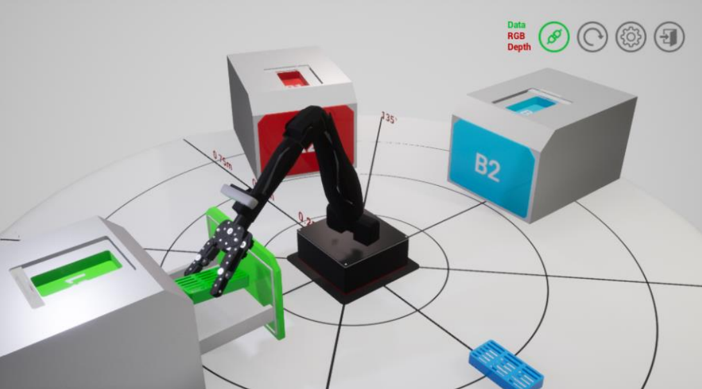

# System for Sterilizing Surgical Tools using Remote Sensing and Actuation
## Table of contents

- [Overview](#overview)
  - [The challenge](#the-challenge)
  - [Screenshot](#screenshot)
- [My Process](#my-Process)
  - [Built with](#built-with)
  - [Code Snippets](#code-Snippets)
  
  
  ## Overview

### The challenge
- Design a computer program for controlling movement of a robotic arm to pick up and transfer a container for sterilization. 
- Interfaces with the Quanser Interactive Labs (Q-Labs) using two muscle sensor emulators.

### Screenshot

#### Q-Labs Environment


#### Transfer of Bin into Sterlization Container


## My process
Transporting six different containers into different drop off positions with the use of muscle sensors requires logic for each flex/extension. There are three large containers which have to be dropped off in an autoclave drawer, so we use the fact that the arms were not at the pickup position (i.e. y coordinate ≠ 0) to open the autoclaves, and when the arm returned home, the autoclave would close. This logic was also used in our control gripper function, where the gripper would close when it was picking up the container and drop off when it was not at the pickup position. I made four different functions and used a for loop with if-elif statements to ensure that certain muscle flex/extentsion will pickup/or return to home position. 

### Built with

- Python: Functions, Conditionals, Loops
- Q-Arm  methods (common_libraries folder) used to move  robotic arm.


### Code Snippets

#### Establish
```python
# Functions

threshold = 0.55

def iden_pos_func(containter_id, position_list):
    position = position_list[cont_id - 1]
    return position

def move_arm_func(position):
    while True:
        if threshold < arm.emg_left() and threshold < arm.emg_right():
            arm.move_arm(position[0], position[1], position[2])
            break

def control_gripper_func():
    while True:
        if threshold < arm.emg_left() and threshold > arm.emg_right() and arm.effector_position()[1] == 0:
            arm.control_gripper(45)
            # The y coordinate of the arm at the pick up position is 0, so we know to close the gripper at the pick up position.
            break
        
        elif threshold < arm.emg_left() and threshold > arm.emg_right() and arm.effector_position()[1] != 0:
            arm.control_gripper(-45)
            # The y coordinate of the arm at the drop off position is not 0, so we know to open the gripper at the drop off position.
            break
```

#### TO DO
```python

def control_autoclave_func(containter_id):
    while True:
        if threshold > arm.emg_left() and threshold < arm.emg_right() and arm.effector_position()[1] != 0:
            # The y coordinate of the arm at the drop off position is not 0, so we know to open the autoclave drawer.
            if containter_id == 4:
                arm.open_red_autoclave(True)
                break
            
            elif containter_id == 5:
                arm.open_green_autoclave(True)
                break
            
            elif containter_id == 6:
                arm.open_blue_autoclave(True)
                break
        
        elif threshold > arm.emg_left() and threshold < arm.emg_right() and arm.effector_position()[1] == 0:
            # The y coordinate of the arm at the home position is 0, so we know to close the autoclave drawer.
            if containter_id == 4:
                arm.open_red_autoclave(False)
                break
            
            elif containter_id == 5:
                arm.open_green_autoclave(False)
                break
            
            elif containter_id == 6:
                arm.open_blue_autoclave(False)
                break

```

#### TO DO

```python
# Pick up, drop off and home positions

pick_up_pos = [0.5336, 0, 0.0443]
home_pos = [0.4064, 0, 0.4826]

small_red_pos = [-0.63, 0.25, 0.4]
small_green_pos = [0, -0.67, 0.4]
small_blue_pos = [0, 0.67, 0.4]
big_red_pos = [-0.378, 0.1575, 0.3125]
big_green_pos = [0, -0.413, 0.3124]
big_blue_pos = [0, 0.4, 0.3124]

pos_list = [small_red_pos, small_green_pos, small_blue_pos, big_red_pos, big_green_pos, big_blue_pos]
```

#### TO DO
```python
# Random ID generator as a list

import random

cont_id_list = list(range(1, 7))
random.shuffle(cont_id_list)

for cont_id in cont_id_list:
    print("Container ID is:", cont_id)
    arm.spawn_cage(cont_id)
    time.sleep(2)
    
    # Finding drop off position
    drop_off_pos = iden_pos_func(cont_id, pos_list)
    time.sleep(2)

    # Pick up
    move_arm_func(pick_up_pos)
    time.sleep(2)
    control_gripper_func()
    time.sleep(2)
    move_arm_func(home_pos)
    time.sleep(2)

    # Drop off
    move_arm_func(drop_off_pos)
    time.sleep(2)

    # Opening autoclaves for large containers
    if cont_id > 3:
        control_autoclave_func(cont_id)
        time.sleep(2)
    control_gripper_func()
    time.sleep(2)
    arm.home()
    time.sleep(2)

    # Closing autoclaves for large containers
    if cont_id > 3:
        control_autoclave_func(cont_id)
        time.sleep(2)

```


